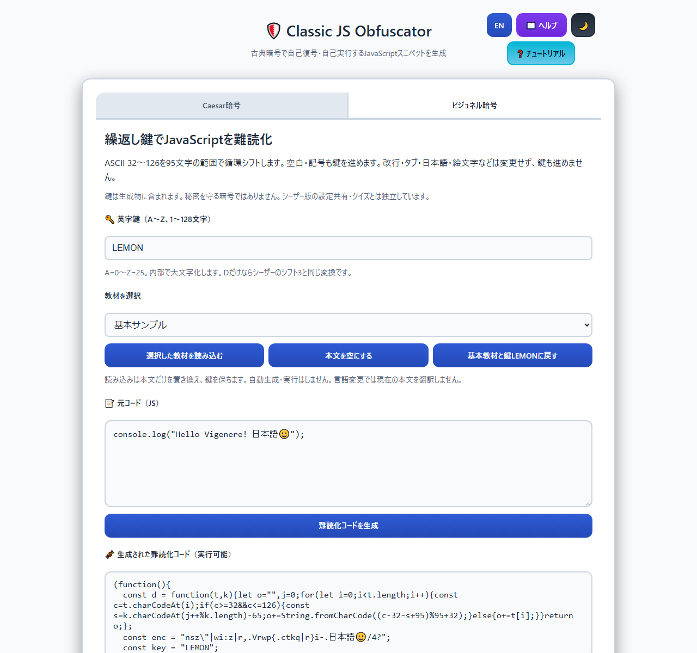
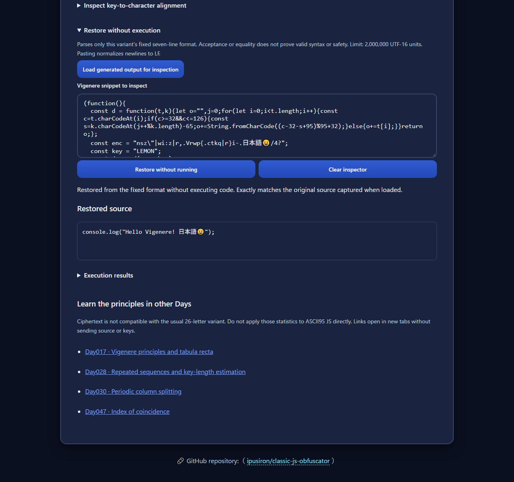
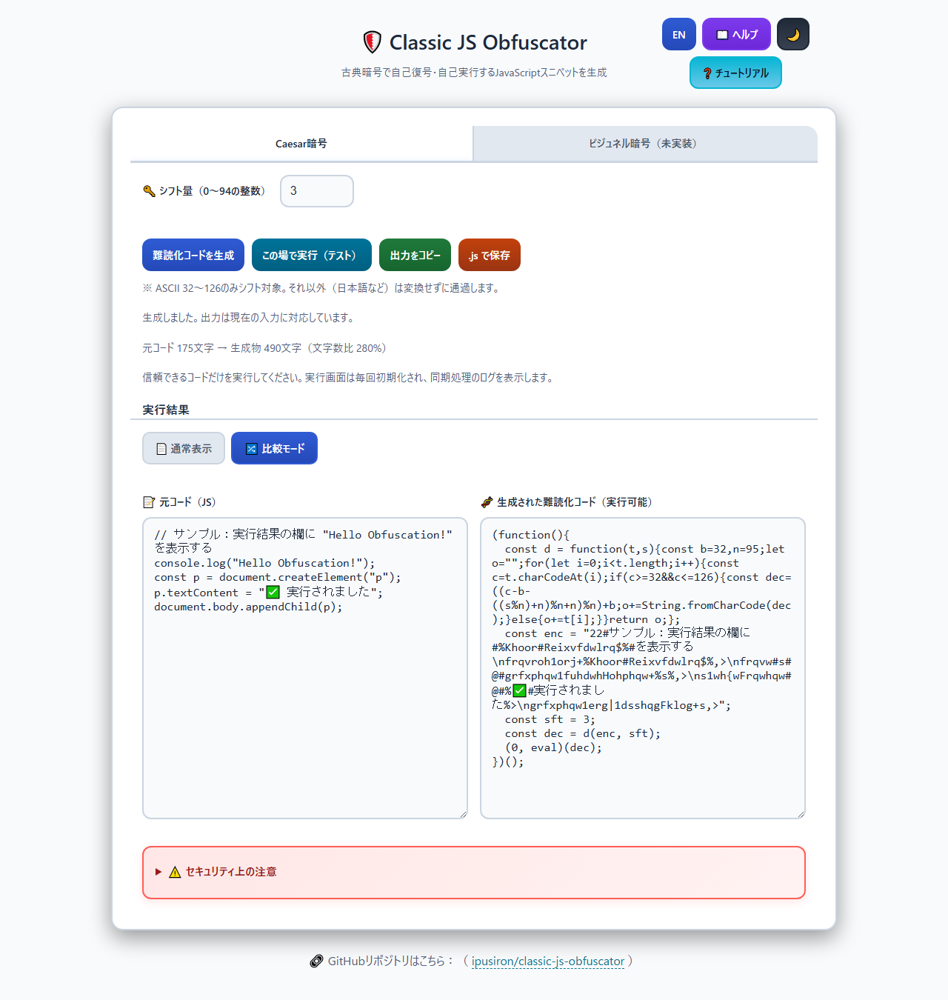
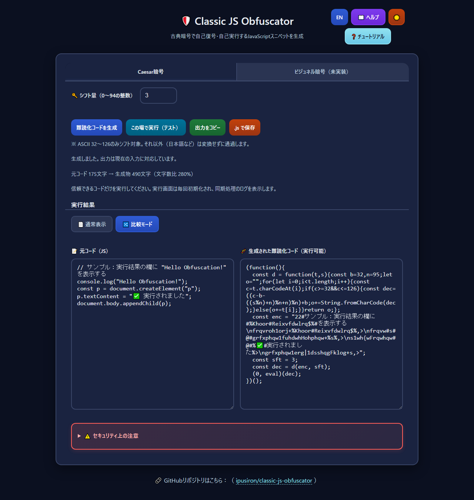
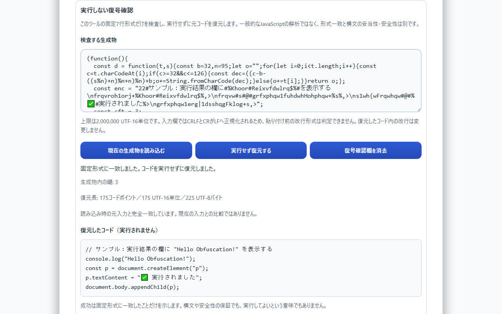
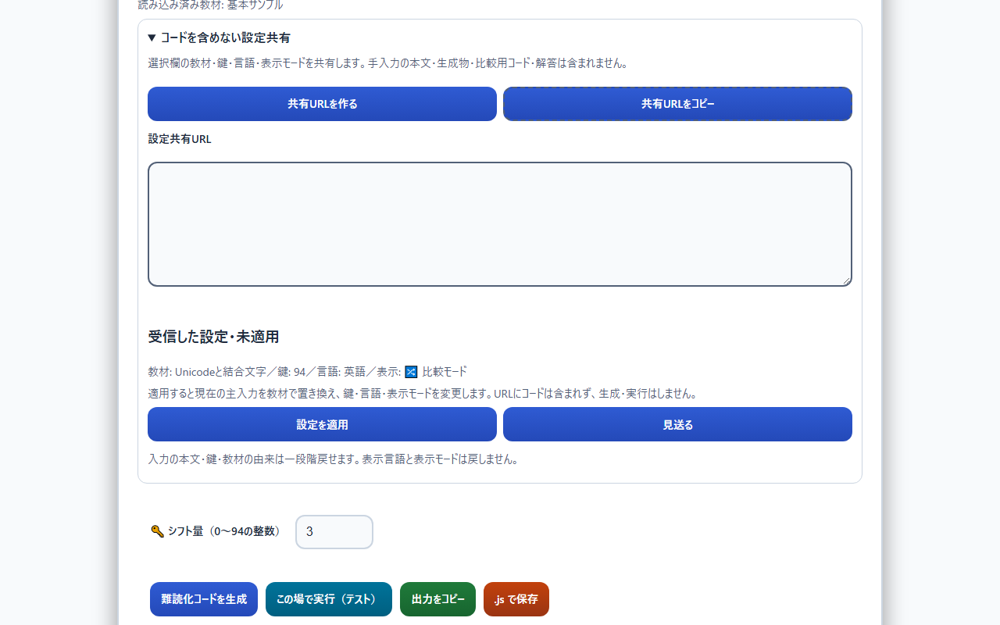
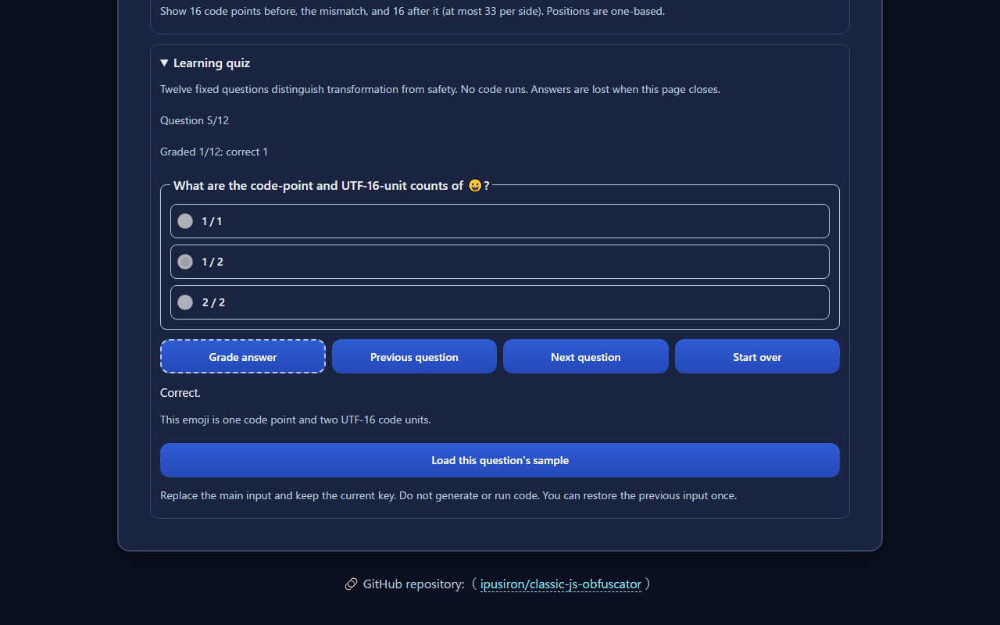
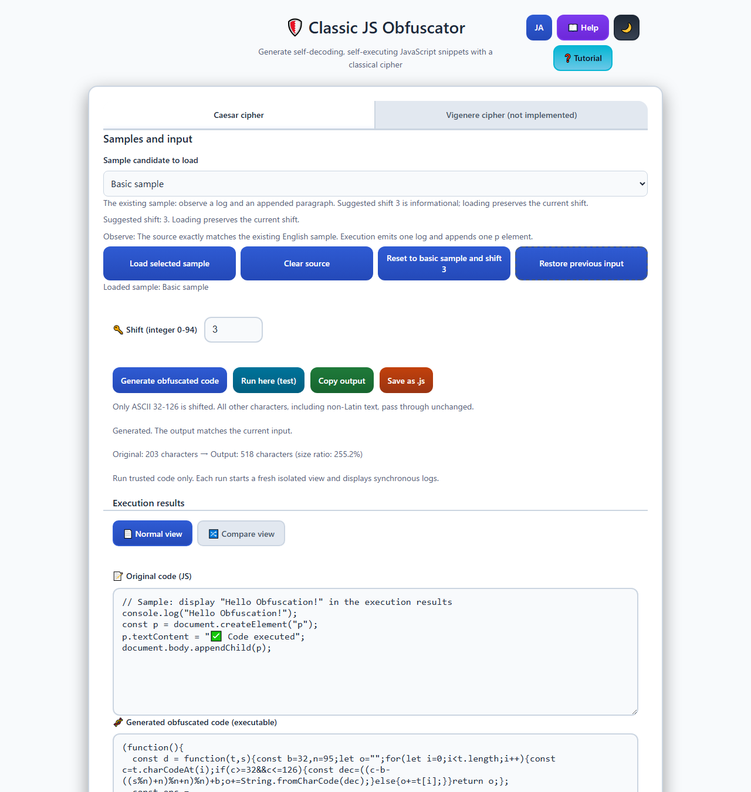
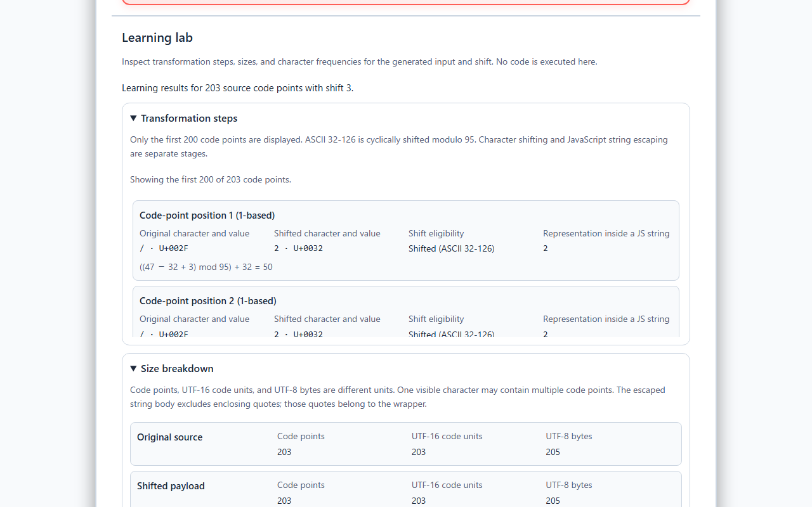

<!--
---
id: day042
slug: classic-js-obfuscator

title: "Classic JS Obfuscator"

subtitle_ja: "古典暗号JavaScript難読化ツール"
subtitle_en: "Classical Cipher JavaScript Obfuscation Tool"

description_ja: "シーザー暗号を使用してJavaScriptコードを難読化し、自己復号・自己実行可能なスニペットを生成するWebツール"
description_en: "A web tool that obfuscates JavaScript code using Caesar cipher and generates self-decrypting, self-executing snippets"

category_ja:
  - 難読化
  - 古典暗号
category_en:
  - Obfuscation
  - Classical Cryptography

difficulty: 2

tags:
  - javascript
  - caesar-cipher
  - obfuscation
  - web-tool

repo_url: "https://github.com/ipusiron/classic-js-obfuscator"
demo_url: "https://ipusiron.github.io/classic-js-obfuscator/"

hub: true
---
-->

# Classic JS Obfuscator - 古典暗号JavaScript難読化ツール

[English](README.en.md) · 日本語


[](https://ipusiron.github.io/classic-js-obfuscator/)

**Day042 - 生成AIで作るセキュリティツール100**

**Classic JS Obfuscator** は、シーザー暗号またはビジュネル暗号のASCII95方式で変換したJavaScriptスニペットを生成するWebツールです。
復号関数＋`eval`を同梱しているため、**自己復号・自己実行可能な** JavaScriptスニペットになります。

シーザー暗号とビジュネル暗号の2つのタブがあり、それぞれ独立した入力と非実行の復元欄を備えています。
画面内の実行は親ページと隔離したsandbox iframeで行います。信頼できるサンプルの学習用であり、秘密情報の保護や不審なコードの安全性判定には使えません。

---

## 🌐 デモページ

👉 [https://ipusiron.github.io/classic-js-obfuscator/](https://ipusiron.github.io/classic-js-obfuscator/)

---

## 📸 スクリーンショット

> 
>
> *英字鍵LEMONによるJavaScript生成を表示した日本語画面*

> 
>
> *非実行での完全一致と、他Dayへの学習リンクを表示した英語画面*

> 
>
> *日本語の通常表示で基本教材と生成物を表示したライトテーマ*

> 
>
> *日本語の学習ラボで変換過程とサイズの分解を開いたダークテーマ*

> 
>
> *独立した比較用コードと復元結果を照合し、不一致文字と前後を表示した日本語画面*

> 
>
> *共有URLの設定を適用せずに確認している日本語画面*

> 
>
> *Unicodeの問題を採点し、解説と進捗を表示した英語画面*

> 
>
> *英語の通常表示で基本教材と生成物を表示したライトテーマ*

> 
>
> *英語の学習ラボで変換過程とサイズの分解を開いたライトテーマ*

---

## ✨ 機能

### 🔐 暗号化機能

- **シーザー暗号による暗号化**：ASCII可視範囲（32〜126）の95文字をシフト
- **ビジュネル暗号による変換**：英字の繰返し鍵でASCII可視文字をシフト。通常の英字26文字方式とは非互換
- **自己復号スニペット生成**：復号関数と暗号化済みペイロードを同梱したIIFE形式
- **シフト量設定**：0〜94の整数を指定。0は無変換であり、値の大小は暗号強度を表さない
- **出力コード**：実行先のCSPとスコープの条件を確認して利用するJavaScript

### 🎨 ユーザーインターフェイス

- **比較モード**：元コードと暗号化後のコードを横並びで表示
- **ダークモード/ライトモード**：テーマ切り替え
- **チュートリアル**：6ステップの操作ガイド
- **ヘルプモーダル**：使い方とセキュリティ情報
- **トースト通知**：コピー成功など操作結果の通知
- **日英切り替え**：ヘルプ、エラー、チュートリアルを含む日本語・英語表示

### ⚡ 便利機能

- **その場でテスト実行**：HTTP/HTTPSで開いた場合のsandbox内実行
- **ワンクリックコピー**：クリップボードへのコピーと、利用できない場合の選択コピー
- **ダウンロード機能**：`.js`ファイルとしての保存
- **レスポンシブデザイン**：モバイル・デスクトップ両対応
- **入力バリデーション**：空欄、小数、指数表記、全角数字、負数、95以上の鍵を拒否
- **出力の更新管理**：入力・鍵・表示モード・言語を変えた場合の出力クリアと再生成案内
- **変換過程の表示**：元の文字、シフト後、エスケープ後をコードポイントごとに比較
- **実行しない復号確認**：固定形式の生成物を復元し、明示読込時の元入力と比較
- **サイズと文字頻度**：3種類の長さ、ラッパーの費用、頻度とエントロピーを表示
- **6種類の教材と一段階復帰**：教材の明示読込、入力クリア、初期化、直前の入力への復帰
- **学習クイズ**：6教材に各2問、日英12問の採点と解説
- **設定共有URL**：コードを含めず、受信した設定を確認してから一括適用
- **独立した比較用コード**：復元文字列との差を、最初の不一致の前後とともに表示

上記の比較モード、頻度、一段階復帰、クイズ、設定共有と独立した比較用コードはシーザータブの機能です。
シーザーの鍵は前後の空白を除去し、先頭の0を許可します。空欄とシフト0は区別します。

### 🛡️ セキュリティ対応

- **クライアント側の変換**：入力コードの送信・保存を行わない変換処理
- **実行の隔離**：`sandbox="allow-scripts"`を付けたiframeと、親子で分けたCSP
- **実行結果の表示**：同期ログと例外を`textContent`で表示
- **保存設定の限定**：テーマと言語だけをlocalStorageに保存し、保存不可でも処理を継続
- **教育目的設計**：難読化とsandboxの限界を画面・文書に表示

---

## 📋 使い方

### 基本的な使い方

1. **コード入力**：「元コード」欄に信頼できるJavaScriptを入力する。
2. **シフト量設定**：0〜94の整数を指定する。初期値は3である。
3. **暗号化実行**：「難読化コードを生成」ボタンを押す。
4. **結果活用**：生成されたコードをコピー・保存し、HTTP/HTTPSではsandbox内で実行する。

入力、鍵、通常表示と比較モード、言語を変更すると、以前の生成物はクリアされます。再生成するまで実行・コピー・保存は無効になります。

### 🎮 便利な機能の使い方

- **比較モード**：「🔀 比較モード」ボタンによる元コードと生成物の横並び表示
- **テーマ切り替え**：ヘッダーの🌙/☀️ボタンによるダークモード/ライトモード切り替え
- **ヘルプ参照**：「📖 ヘルプ」ボタンによる説明の表示
- **チュートリアル**：「❓ チュートリアル」ボタンによる6ステップの操作案内
- **キーボード操作**：矢印/Home/Endによるタブ移動、Tabによるダイアログ内移動、Escapeによる終了
- **言語切り替え**：ヘッダーの日英切り替えボタンによる表示変更

初期言語は`?lang=ja`または`?lang=en`、保存した言語、ブラウザーの言語の順に決まります。ブラウザーの言語が日本語以外なら英語になります。テーマと言語はlocalStorageに保存しますが、保存や読み出しが拒否されても既定値で動作を続けます。入力コードと生成物は保存しません。

### 🧪 サンプルコードで動作確認（初回実験手順）

日本語画面を開くと、次のサンプルが入力欄に表示されます。変換と隔離実行の確認に使えます。

<!-- sample:start -->
```javascript
// サンプル：実行結果の欄に "Hello Obfuscation!" を表示する
console.log("Hello Obfuscation!");
const p = document.createElement("p");
p.textContent = "✅ 実行されました";
document.body.appendChild(p);
```
<!-- sample:end -->

**実験手順：**

1. 上のサンプルが入力欄に表示されていることを確認する。
2. シフト量を初期値の3にする。
3. 「難読化コードを生成」ボタンを押す。
4. 出力欄に生成物が表示されることを確認する。
5. HTTP/HTTPSで開いた画面で「この場で実行（テスト）」ボタンを押す。
6. 実行結果欄の「Hello Obfuscation!」と、iframe内の「✅ 実行されました」を確認する。

生成されるコードは次のとおりです。日本語はシフト対象外なので、コメントや文字列の日本語部分は生成物にも残ります。

<!-- snippet:start -->
```javascript
(function(){
  const d = function(t,s){const b=32,n=95;let o="";for(let i=0;i<t.length;i++){const c=t.charCodeAt(i);if(c>=32&&c<=126){const dec=((c-b-((s%n)+n)%n+n)%n)+b;o+=String.fromCharCode(dec);}else{o+=t[i];}}return o;};
  const enc = "22#サンプル：実行結果の欄に#%Khoor#Reixvfdwlrq$%#を表示する\nfrqvroh1orj+%Khoor#Reixvfdwlrq$%,>\nfrqvw#s#@#grfxphqw1fuhdwhHohphqw+%s%,>\ns1wh{wFrqwhqw#@#%✅#実行されました%>\ngrfxphqw1erg|1dsshqgFklog+s,>";
  const sft = 3;
  const dec = d(enc, sft);
  (0, eval)(dec);
})();
```
<!-- snippet:end -->

この例は`test/fixtures/expect.json`の参照データと一致し、自動テストで検査します。

### 生成物の利用とスコープ

生成物は文字列を復号し、間接呼び出しの`eval`で実行します。非strictのトップレベルの`function`と`var`は実行先のグローバルに残りますが、`let`・`const`やstrictモード内の宣言は同じ扱いにはなりません。元のスクリプトとスコープが完全に同じになることは保証しません。ツール内での実行先はiframeであり、親ページには宣言が残りません。

HTMLの`<script>`内へ貼る場合、入力由来の文字列に含まれる`<`は十六進エスケープへ変換されます。復号関数内の比較演算子は維持しています。この処理はHTMLによるスクリプトの途中終了を防ぐためのもので、実行するコードの安全性を保証するものではありません。

実行先で`eval`を禁止しているCSPでは生成物は動きません。インラインスクリプトにも別の制限があるため、既存サイトのCSPを緩めて貼り付けず、このツールの隔離した実行画面で学習してください。`.js`ファイルとして読み込む場合も、動的評価の制限は適用されます。

### 学習ラボの使い方

学習ラボは、生成に使った元入力と鍵から変換過程、サイズ、文字頻度を計算します。
通常表示と比較モードのどちらでも同じ結果になります。

1. 教材を読み込み、鍵を確認して「難読化コードを生成」を押す。
2. 「変換過程」を開き、元の文字から文字列リテラルまでの変化を確認する。
3. 「サイズの分解」と「文字頻度」を開き、増加した部分と変わらない性質を比べる。
4. 「実行しない復号確認」で「現在の生成物を読み込む」を押す。
5. 「実行せず復元する」を押し、形式一致、復元内容、読込時の元入力との比較を確認する。

入力、鍵、表示モード、言語の変更や、教材読込、クリア、初期化、復帰を行うと、生成物と学習表示は消去されます。
教材読込などの操作で入力が同じままでも再生成が必要です。
学習集計の上限は元入力100,000UTF-16単位です。
これを超えると学習表示だけを消去して上限を知らせ、既存の生成処理は継続します。
`file://`でも生成、学習、非実行の復元を利用できますが、既存のコード実行は無効です。

#### 変換過程を見る

各行は、元のコードポイント、ASCIIシフト対象かどうか、シフト後の文字、エスケープ後の文字列本体を示します。
表示は先頭200コードポイントまでで、全体の件数も表示します。
空白、制御文字、結合文字、双方向制御文字、孤立サロゲートなどは、識別用のラベルと`U+`表記で示します。
これらの表示ラベルを元入力や生成物へ書き戻すことはありません。

コードポイント数は見た目の文字数ではありません。
😀は1コードポイントですが、結合文字や複数のコードポイントからなる絵文字は別々に数えます。

#### 実行せずに復号を確認する

復号確認欄は、主入力と独立した貼付欄です。
このツールが生成する固定7行形式だけを受け付け、一般のJavaScript難読化を解除する機能ではありません。
埋め込みの復号関数、鍵の表記、引用符、空白、改行形式、生成器が出すエスケープを検査し、復元後の再生成結果まで照合します。
生成器に渡す鍵では`003`を許可しますが、生成物の鍵表記は`3`であり、検査でも正規表記だけを受け付けます。
追記したコード、改変した復号関数、HTMLやMarkdownによる囲み、途中で切れた生成物は受け付けません。

検査は文字列処理だけで行い、`eval`や`Function`、script要素、実行用iframeへ渡しません。
復元内容は読み取り専用欄に文字列として表示し、元入力へ書き戻しません。
「形式一致」はJavaScriptとしての構文妥当性や安全性を保証する判定ではありません。
「読込時の元入力と一致」も、その文字列との一致だけを意味し、安全性とは別です。

「現在の生成物を読み込む」は、まだ有効な生成物と、その生成に使った元入力をメモリ内に記録します。
読込だけでは復元せず、前の検査結果を消して未検査に戻します。
その後に主入力や鍵を変えても、比較相手は読込時の元入力のままで、現在の主入力とは比較しません。
貼付欄を手動で編集すると、同じ文字列を入力した場合でも比較元と結果を消去します。
手動貼付した生成物は復元できますが、比較元はありません。
検査失敗では以前の復元結果を残さず、「復号確認欄を消去」は貼付内容と比較元も消去します。
言語切替では貼付内容、検査結果、比較元を保ち、説明だけを翻訳します。

比較はJavaScript文字列の完全一致で、空白除去、Unicode正規化、改行変換をしません。
不一致の位置は1始まりのコードポイント位置で示し、片方の末尾に達した場合も区別します。
検査入力の上限は2,000,000UTF-16単位です。
空の貼付欄は検査エラーですが、空コードから生成した正規のスニペットは復元に成功します。

純粋処理が許すラッパーの改行形式は、全行LFまたは全行CRLFと、末尾改行なしまたは1個だけです。
混在改行、裸のCR、BOM、余分な空白などは拒否します。
ただし、ブラウザーのtextareaはCRLFとCRをLFへ正規化するため、貼付前の改行形式までは判定できません。
このラッパーの正規化とは別に、復元したコード内の改行は保持します。
孤立サロゲートはメモリ内の文字列として保持できますが、UTF-8保存時はU+FFFDへ置換されます。
メモリ内での復元一致が、保存したファイルの一致を保証するわけではありません。

#### 比較用コードと不一致の前後

「任意の比較用コードとの比較」は、上の「読込時の元入力との比較」とは別の比較です。
比較用コード欄へ入力するか、「現在の主入力を取り込む」を押してください。
生成物を実行せずに復元したあと、「比較用コードと比較」を押すと結果を表示します。
取込と手入力だけでは自動比較しません。

比較元の未設定と空文字は区別します。
空の文字列も比較できますが、「比較元をクリア」で未設定へ戻すと比較は無効になります。
比較元のクリアでは、検査入力や復元結果、読込時の元入力との比較は消しません。
主入力の編集、教材読込、設定共有の適用は、独立した比較用コードや比較結果を変更しません。
検査欄の編集、再読込、消去、復元の成功や失敗は前の独立比較結果を消しますが、比較用コードは保持します。
同じ文字列を比較用欄へ再入力した場合も、前の比較結果を消します。

比較は各文字列2,000,000 UTF-16単位までで、空白削除、Unicode正規化、改行変換、孤立サロゲート修復は行いません。
最初の不一致を1始まりのコードポイント位置で示し、各側の前16、該当位置、後16を最大33トークンで表示します。
片側の末尾はEOFと示し、前後の省略と総コードポイント数も区別します。
制御文字や結合文字はラベルとU+値で示し、その表示を比較する文字列へ書き戻しません。
完全一致は文字列の一致であり、実行の安全性を保証しません。

主入力を取り込むと、その時点の内部文字列を保持します。
textareaはCRLFとCRをLFで表示しますが、表示のために取込時の文字列を変更しません。
比較用欄を編集した時点で、表示欄の値を新しい比較元にします。
言語切替は比較元や不一致位置を保ち、説明だけを翻訳します。

#### サイズと文字頻度を比べる

サイズはコードポイント数、JavaScriptのUTF-16単位数、`TextEncoder`で測るUTF-8バイト数を分けて表示します。
たとえば`A😀`は2コードポイント、3UTF-16単位、5UTF-8バイトです。
エスケープ後の文字列本体には、囲みの引用符を含めません。
引用符や復号関数などはラッパー側で数え、同じ部分を重複して加算しません。
次の表は、前掲の日本語サンプルを鍵3で変換した値です。

<!-- learning-sizes:start -->
| 対象 | コードポイント | UTF-16単位 | UTF-8バイト |
|---|---:|---:|---:|
| 元コード | 175 | 175 | 225 |
| シフト後payload | 175 | 175 | 225 |
| エスケープ後文字列本体 | 179 | 179 | 229 |
| エスケープ増分 | 4 | 4 | 4 |
| 復号関数 | 199 | 199 | 199 |
| 固定構文 | 111 | 111 | 111 |
| 鍵の桁 | 1 | 1 | 1 |
| ラッパー合計 | 311 | 311 | 311 |
| 生成物全体 | 490 | 490 | 540 |
<!-- learning-sizes:end -->

3単位のそれぞれで「元コード＋エスケープ増分＋ラッパー＝生成物」が成立します。
ラッパーは「復号関数199＋固定構文111＋鍵の桁数」です。
空コードの生成物は1桁の鍵なら311、鍵94なら312で、常に311ではありません。
比率は生成物を元コードで割った百分率で、圧縮率や暗号強度ではありません。
元コードが空なら比率を定義できないため、学習ラボでは「—」と理由を表示します。
既存の出力統計では従来どおり「未定義」と表示します。

頻度は元入力のコードポイントを全件集計し、出現回数の多い順、同数ならコードポイントの数値が小さい順に並べます。
上位20種類だけを表示し、残りの出現回数を「その他」にまとめます。
各行で元の文字とシフト後の文字を対応させ、回数と全体に対する割合を表示します。
次の値も同じ日本語サンプルと鍵3によるものです。

<!-- learning-stats:start -->
| 項目 | 値 |
|---|---:|
| コードポイント比（%） | 280.0 |
| UTF-8バイト比（%） | 240.0 |
| 全コードポイント数 | 175 |
| 異なるコードポイントの種類数 | 57 |
| 表示する種類数 | 20 |
| 表示する種類の出現回数合計 | 127 |
| その他の出現回数 | 48 |
| シフト対象外のコードポイント数 | 29 |
| 元コードのエントロピー（bit/コードポイント） | 5.2597 |
| シフト後payloadのエントロピー（bit/コードポイント） | 5.2597 |
<!-- learning-stats:end -->

ASCII範囲のシフトは一対一の置換で、対象外の文字も保持するため、出現回数の分布とエントロピーは変わりません。
エントロピーは元コードとシフト直後のpayloadを比較し、ラッパー付き生成物とは混同しません。
値の高さや不変性は安全性を示すものではありません。
空入力のエントロピーは0、対象外率は分母がないため「—」です。

#### 教材と入力の復帰

教材は基本（`basic`）、ASCII折返し（`ascii-wrap`）、Unicode（`unicode`）、エスケープ（`escapes`）、ログ（`console`）、スコープ（`scope`）の6種類です。
選択欄を変えるだけでは主入力を置き換えず、読込ボタンを押した時点で反映します。
教材読込は現在の鍵を保持し、各教材の推奨鍵は案内だけに使います。
クリアは元入力だけを空にして鍵を保ち、初期化は現在の言語の基本教材と鍵3へ戻します。

教材読込、クリア、初期化で状態が変わる直前に、元入力、鍵、教材の出自を一段階だけ記録します。
入力の復帰はその1回分を戻して記録を消費する操作で、編集履歴やredoではありません。
同じ状態への操作では復帰記録を上書きしません。
手入力した本文や鍵の変更は、新しい復帰記録を作りません。
未編集の教材は言語切替に合わせて翻訳しますが、一度手入力した本文は、教材と同文でも自動翻訳しません。
別言語の未編集教材を復帰した場合は、本文と鍵をそのまま戻し、現在の言語の教材として再翻訳しないカスタム入力にします。
これらの状態と復帰記録はメモリ内だけに置き、localStorageへ保存しません。

---
#### 学習クイズ

6教材それぞれ2問、固定12問を日英で用意しています。
選択肢を選んで採点すると、正誤と解説を表示します。
採点後の選択は固定され、連打や再採点で得点は増えません。
「採点済み」と「正答」の件数を分け、未回答の問題が残っていても前後へ移動できます。
最終問の採点後に自動で最初へ戻ることはありません。

問題移動、言語やテーマの切替、生成、入力編集、教材読込でも回答を保持します。
「最初から」はクイズだけを初期化し、主入力や検査欄を変更しません。
回答はこのページ内のメモリーにだけ置き、再読込すると消えます。
「この問題の教材を読み込む」は主入力を置き換えて現在の鍵を保ち、一段階復帰の対象になります。
推奨鍵は案内だけで、教材の読込によって生成や実行は始まりません。

#### コードを含めない設定共有

「共有URLを作る」は、選択欄の教材ID、鍵、表示言語、通常表示または比較モードをURLへまとめます。
主入力が手入力でも、共有対象は選択欄の教材です。
入力コード、生成物、復元文字列、比較用コード、クイズの解答、テーマは含めません。
現在のURLのクエリーやローカルファイルのパスも引き継ぎません。

次はUnicode教材、鍵3、英語、比較モードを共有する例です。
通常の鍵入力で許される`003`は、共有URLでは`3`に正規化します。

<!-- phase3-url:start -->
`https://ipusiron.github.io/classic-js-obfuscator/#cjo=v1&sample=unicode&key=3&lang=en&view=compare`
<!-- phase3-url:end -->

受信した設定はプレビューに表示するだけで、入力を自動変更しません。
「設定を適用」を押すと、指定言語の教材と鍵、表示モードを一括反映し、古い生成物を消します。
生成や実行は自動では始まりません。
「見送る」やブラウザーの戻る、進むでも主入力は変更しません。

適用直前の本文、raw鍵、教材の由来は一段階だけ復帰できます。
表示言語と表示モードは復帰の対象外です。
同一設定の適用では以前の復帰記録を保ち、異なる言語で保存した未編集教材を復帰すると、本文を保持してカスタム入力として扱います。

共有用hashは最大200 UTF-16単位で、版、教材ID、正規形の鍵、言語、表示モードを厳密に検査します。
未知の項目や版、重複キー、先頭0やパーセント表記の受信鍵は拒否し、入力や設定を変えません。
このツールの共有形式ではないアンカーは無視します。
設定を変えると作成済みURLを消し、コピー待機中の変更では古いURLの成功通知を出しません。
コピーを許可しない環境では、選択されたURLを手動でコピーできます。

### ビジュネル暗号タブの使い方

1. ビジュネル暗号タブを開き、JavaScriptと英字鍵を入力する。
2. 「難読化コードを生成」を押し、必要に応じてコピーまたはJS保存を行う。
3. 「鍵と文字の対応を見る」で、先頭200コードポイントの変換と鍵の位置を確認する。
4. 「生成物を復元欄へ読み込む」→「非実行で復元」で、読み込み時の原文との完全一致を確認する。
5. 実行する場合だけ実行結果を開き、信頼できるコードをHTTP(S)の隔離画面でテストする。

鍵は英字1〜128文字で、前後の空白を除去して内部で大文字化します。
数字、記号、途中の空白、全角英字は使えません。
A=0〜Z=25のシフトを繰り返し、Dだけならシーザーのシフト3と同じ変換です。
Aだけの鍵では本文が変わりません。
ASCII 32〜126の空白や記号は鍵を進めますが、改行、タブ、日本語、絵文字などはそのまま通過し、鍵も進めません。
次は固定テストに収録した例です（JSONのエスケープ表記）。

<!-- vigenere-vector:start -->
```json
{"source":"A\nB\tC日本語😀D","key":"BC","payload":"B\nD\tD日本語😀F"}
```
<!-- vigenere-vector:end -->

空の本文も有効です。
本文・生成物・復元入力の各上限は2,000,000 UTF-16単位です。
エスケープで生成物が上限を超える場合も拒否します。
サイズはコードポイント数、UTF-16単位、UTF-8バイトの順で表示します。
孤立サロゲートはメモリー上では保持しますが、UTF-8保存時にはU+FFFDへ置換されます。
入力欄への貼付ではCRLFやCRがLFになります。

教材は既存6種類を再利用し、明示読込では本文だけを置き換えて現在の英字鍵を保ちます。
本文を空にする操作も鍵を保ち、初期化は現在の表示言語の基本教材と鍵LEMONに戻します。
言語変更では現在の本文を翻訳せず、生成物だけを失効させます。
復元欄は主入力から独立し、言語変更後も復元した生文字列を保持します。
手入力の生成物には生成時原文との比較はなく、改変した固定形式や余分なコードは拒否します。
復元や文字列一致は構文の正しさ・実行の安全性を保証しません。
タブを切り替えると両タブの実行フレームを破棄します。
file://では生成・復元・保存を利用でき、隔離実行にはHTTP(S)が必要です。

原理や分析は次のツールで学べます。
リンクは別タブで開き、本文・鍵・生成物を送信しません。

- [Day017 Vigenere Cipher Tool](https://ipusiron.github.io/vigenere-cipher-tool/)：英字26文字での原理とタブラレクタ
- [Day028 RepeatSeq Analyzer](https://ipusiron.github.io/repeatseq-analyzer/)：反復と鍵長推定
- [Day030 ModularTextDivider](https://ipusiron.github.io/modular-text-divider/)：周期的な列分割
- [Day047 IC Learning Visualizer](https://ipusiron.github.io/ic-learning-visualizer/)：一致指数

Day042はASCII95方式なので、英字26文字方式の暗号文とは互換ではありません。
関連ツールの統計・推定をASCII95のJSへ直接当てはめないでください。
このタブには設定共有、クイズ、一段階復帰、詳細な頻度分析を追加していません。
鍵は生成物に含まれ、秘匿を目的とする暗号には使えません。

## ⚠️ 注意

- 本ツールは秘匿ではなく難読化（可読性低下）を目的とした教材である。
- 生成物には復号処理と鍵が含まれ、静的解析で元コードを復元できる。
- ASCII 32〜126以外の文字は変換しないため、日本語や絵文字はそのまま残る。
- 秘密情報を入力せず、出所や内容を確認できないコードは実行しない。
- 生成物を別のページで実行した場合、このツールのsandboxによる隔離は引き継がれない。

### セキュリティに関する説明

変換処理はブラウザー内で行い、入力コードをサーバーへ送信する機能はありません。ただし、実行するJavaScript自体はプログラムです。「クライアント側だから安全」「他者への影響は不可能」とは保証できません。

親ページはCSPで`eval`を禁止しています。`eval`を許可するのは実行用iframeの文書だけで、iframeには`allow-same-origin`を付けません。iframeから親ページのDOMやlocalStorageへ直接アクセスできないようにし、結果は送信元・origin・実行IDを検査した`postMessage`で受け取ります。実行用文書のCSPでは接続、フォーム送信、追加iframeなども制限しています。

各実行でiframeを作り直し、同期処理中のconsole出力と例外を結果欄へ返します。consoleの一時的な変更は同期処理の終了時に復元するため、タイマーなどの非同期console出力は結果欄に表示しません。非同期の例外・未処理のPromise拒否は、再生成や入力・設定の変更でiframeが破棄されるまで通知します。「実行完了」は同期処理の完了を示します。

実行へ渡すコード長は200万UTF-16コード単位、ログと例外はそれぞれ100件、1件の通知は4,000UTF-16コード単位を上限とします。これらの上限は、後述の文字数表で使うコードポイント単位とは異なります。

読込や同期実行の応答を待つ時間には5秒の制限がありますが、ブラウザーのイベント処理が止まる無限ループを確実に終了できる仕組みではありません。sandboxはCPU・メモリーの資源隔離や、あらゆる通信経路の遮断を保証しません。不審なコードを解析するための環境としては使わないでください。

localStorageへ保存するのはテーマと言語だけです。設定の読み書きは例外を処理し、Storageを利用できない場合も画面を初期化します。個人用の`.claude/`設定は追跡対象外です。過去のGit履歴に含まれる情報まで削除する変更ではありません。

---

## 🔬 技術・セキュリティ解説

本ツールで使用されている技術の詳細解説と、セキュリティの観点からの考察については以下をご覧ください：

📖 **[技術解説・セキュリティガイド](SECURITY.md)**

- シーザー暗号の実装詳細
- 自己復号スニペットの構造
- 難読化の限界と防御上の注意
- 防御側の検知技術
- セキュリティ研究者への提言

### 参照サンプルの文字数とエントロピー

文字数はコードポイント単位で数えます。😀のような単一コードポイントの絵文字は1と数えますが、見た目が1文字でも複数コードポイントの場合があります。次の値は前掲の日本語サンプルをシフト3で変換した場合の値です。

<!-- stats:start -->
| 項目 | 値 |
|---|---:|
| 元コードの文字数 | 175 |
| シフト対象の文字数 | 146 |
| 対象外の文字数 | 29 |
| 生成物の文字数 | 490 |
| 文字数比（%） | 280 |
| 変換前のエントロピー（bit/文字） | 5.2597 |
| 変換後ペイロードのエントロピー（bit/文字） | 5.2597 |
<!-- stats:end -->

「文字数比」は生成物の文字数を元コードの文字数で割った百分率です。圧縮性能を表す値ではありません。この例の鍵3では、空入力は生成物311文字、文字数比は画面では「未定義」と表示します。シーザー変換は文字の出現頻度を保つため、エントロピーの増加を安全性や難読化の検知根拠にできません。

---

## 🎯 実装済み機能

### v1.0で実装された主要機能

- ✅ **シーザー暗号による暗号化**
- ✅ **比較モード（横並び表示）** 
- ✅ **ダークモード/ライトモード切り替え**
- ✅ **チュートリアル機能**
- ✅ **ヘルプモーダル**
- ✅ **トースト通知**
- ✅ **入力バリデーション**
- ✅ **レスポンシブデザイン**
- ✅ **隔離実行と同期ログ・例外の表示**
- ✅ **日英表示と設定保存の例外処理**
- ✅ **CSP・キーボード操作・ARIA・配色の改善**
- ✅ **参照値と文書を検査する自動テスト**

### 将来の拡張予定

以下は従来の構想に含まれていた検討項目です。いずれも未実装で、今回の改善には含まれません。追加を保証する予定表ではなく、今後は防御と学習に役立つ内容を選びます。

- **さらに別の暗号方式への対応**：実装済みのシーザー・ビジュネル以外の変換規則を比較する教材案
- **多段暗号化**：従来の構想に含まれていた未実装項目
- **鍵の難読化**：未実装項目であり、鍵の秘匿を保証する機能ではない
- **Unicode対応**：現在の範囲外文字の保持とは別に、変換対象を学ぶための検討案
- **変数名・関数名の難読化**：従来の構想に含まれていた未実装項目
- **CLI版・Node.js対応**：現在のNode.js利用は自動テストであり、利用者向けCLIは未実装

---

## 🧪 テスト

Node.js 22以上で、リポジトリのルートから実行します。npmの依存パッケージはなく、インストールやビルドは不要です。

```sh
npm test
```

`node --test`で、既知解答、全95シフトの往復、文字列エスケープ、鍵の検証、統計、sandboxの通信、HTML、配色、文書を検査します。READMEの生成例・数値表・日英の見出し対応も自動テストの対象です。GitHub Actionsはpushとpull_requestで同じテストを実行します。実画面の配置やブラウザー固有の挙動は、ブラウザーで別途確認します。

学習機能では、固定形式の受理と拒否、非実行の復元、サイズの分解、頻度、上限、6教材、入力の一段階復帰、学習表示の失効、独立した復号確認欄も検査します。
新しい数値表は`test/fixtures/learning-expect.json`の固定値と`LearningCore`の再計算結果の両方に照合します。

### ブラウザー検査とCI

公開アプリとNodeテストにはランタイム依存もnpm依存もありません。
ブラウザー検査だけはPython版Playwrightを使い、固定12問、共有設定2,280通りのNode検算、不一致前後の参照データとともに保守します。
追加の固定値は`test/fixtures/phase3-expect.json`に収録し、SHA-256で変更を検知します。

`test/browser/requirements.txt`はplaywright 1.63.0、greenlet 3.5.6、pyee 13.0.1、typing-extensions 4.16.0をwheelのSHA-256付きで固定しています。
対応環境はWindows CPython3.10 x64とLinux CPython3.12 x64です。
venv、対応ブラウザー、検査結果はリポジトリー外に配置してください。
たとえばPOSIX環境では、リポジトリールートで次のように実行します。

```sh
python3.12 -m venv ../day042-browser-venv
export PLAYWRIGHT_BROWSERS_PATH="$(cd .. && pwd)/day042-browsers"
export BROWSER_REPORT_DIR="$(cd .. && pwd)/day042-browser-report"
../day042-browser-venv/bin/python -m pip --isolated --disable-pip-version-check install --require-hashes --no-deps --retries 0 --index-url https://pypi.org/simple -r test/browser/requirements.txt
../day042-browser-venv/bin/python -m pip check
../day042-browser-venv/bin/python -m playwright install chromium
../day042-browser-venv/bin/python -B test/browser/smoke.py --full
```

WindowsではPython3.10でvenvを作り、`Scripts/python.exe`とPowerShellの環境変数設定を使います。
ブラウザー用のOS依存が必要なLinuxでは、環境管理者が公式手順に従って導入してください。
CIは使い捨てのUbuntu runner内でのみ`install --with-deps chromium`を実行します。

既定のブラウザー検査はHTTP/file、日英、ライト/ダーク、幅320/1280pxの16条件です。
`--full`では390/768pxを加えた32条件に増やします。
別にStorageの読み書き拒否4条件、初回共有URLのプレビュー4条件、初回テーマ12条件を検査します。
保存テーマはCSSより前に外部JSで反映し、メインJSの読込を待つ間のテーマ切替を防ぎます。
小画面はモバイルコンテキストで開き、検査中は外部要求を遮断し、クリップボードを実際には上書きしません。
結果JSONは指定した出力先へ保存します。

GitHub Actionsは既存のNode検査とは別に、このブラウザー検査をpushとpull_requestで実行します。
失敗時のartifactは合成ケースの診断だけを7日間保持します。
利用者の入力、プロファイル、環境変数一覧を収集する機能ではありません。
Chromiumの自動検査は、他ブラウザーや実機での確認を代替するものではありません。

## 📁 ディレクトリー構造

フォルダーの親子関係をツリーで示します。`/`で終わる項目はフォルダーです。

<!-- inventory:start -->
```text
classic-js-obfuscator/               # プロジェクトルート
├── .github/                         # GitHub設定
│   └── workflows/                   # 自動テストの定義
│       ├── browser.yml              # ハッシュ固定のブラウザーテスト
│       └── test.yml                 # Node.js 22でpush・pull_requestを検査
├── .gitignore                       # 個人用設定の除外
├── .nojekyll                        # GitHub PagesでJekyll処理を無効化
├── assets/                          # 画面のスクリーンショット
│   ├── en/                          # 英語画面の画像
│   │   ├── screenshot.png           # 英語・ライトテーマの通常表示
│   │   ├── screenshot2.png          # 英語・ライトテーマの学習ラボ
│   │   ├── screenshot3.png          # 英語・ダークテーマの学習クイズ
│   │   └── vigenere.png             # 英語・ダークテーマのビジュネル復元
│   ├── screenshot.png               # 日本語・ライトテーマの通常表示
│   ├── screenshot2.png              # 日本語・ダークテーマの学習ラボ
│   ├── screenshot3.png              # 日本語・ライトテーマの不一致前後表示
│   ├── screenshot4.png              # 日本語・ライトテーマの共有プレビュー
│   └── vigenere.png                 # 日本語・ライトテーマのビジュネル生成
├── CLAUDE.md                        # 開発構成と作業上の規則
├── index.html                       # 画面構造と親ページのCSP
├── js/                              # 共通処理のモジュール
│   ├── comparison-context.js        # 不一致位置と前後の抽出
│   ├── editor-state.js              # 入力の出自と一段階の復帰
│   ├── i18n.js                      # 日英辞書と言語設定
│   ├── learning-core.js             # 非実行の復号確認・変換過程・サイズ・頻度
│   ├── learning-ui.js               # 学習表示・失効と独立した復号確認
│   ├── obfuscator-core.js           # DOM非依存の変換・検証・統計
│   ├── quiz-core.js                 # 採点・問題移動・進捗の状態
│   ├── quiz-data.js                 # 固定12問の日英データ
│   ├── quiz-ui.js                   # クイズの操作と日英表示
│   ├── samples.js                   # 同一IDを持つ6教材の日英データ
│   ├── sandbox-runner.js            # iframeの生成とメッセージ検証
│   ├── share-settings.js            # コードを含めない共有設定の文法
│   ├── share-ui.js                  # 共有URLと受信設定の明示適用
│   ├── theme-init.js                # 初回描画前に保存テーマを反映
│   ├── vigenere-core.js             # ASCII95の繰返し鍵変換と非実行復元
│   └── vigenere-ui.js               # ビジュネルの独立入力と復元画面
├── LICENSE                          # MITライセンス
├── package.json                     # 依存なしのテスト実行設定
├── README.en.md                     # 同じ内容の英語版
├── README.md                        # 日本語の機能説明と使い方
├── sandbox/                         # 隔離実行用の文書と処理
│   ├── runner.css                   # 隔離画面のスタイル
│   ├── runner.html                  # 実行文書と専用CSP
│   └── runner.js                    # 隔離実行・ログ・例外の通知
├── script.js                        # 画面操作と状態の更新
├── SECURITY.md                      # 難読化の限界と防御・検知の説明
├── style.css                        # 日英・テーマ・画面幅に対応するスタイル
└── test/                            # Node.js標準テスト
    ├── browser/                     # 自己完結するブラウザーテスト
    │   ├── requirements.txt         # バージョンとwheelハッシュの固定
    │   └── smoke.py                 # HTTP・file・言語・テーマの回帰検査
    ├── comparison.test.js           # 前後抽出と文字列上限
    ├── contrast.test.js             # ライト・ダークの配色比
    ├── core.test.js                 # 既知解答・往復・鍵・統計
    ├── editor-state.test.js         # 教材・言語・復帰の状態遷移
    ├── fixtures/                    # 変更しない参照データ
    │   ├── expect.json              # 生成例と既知解答の期待値
    │   ├── learning-expect.json     # 学習機能の固定参照値
    │   ├── phase3-expect.json       # 第3弾の固定参照値
    │   └── vigenere-expect.json     # ビジュネル拡張の固定参照値
    ├── format.test.js               # UTF-8・行長・可読性
    ├── html.test.js                 # CSP・HTML・ARIA・ローカル資産
    ├── i18n.test.js                 # 日英辞書と表示の対応
    ├── learning-core.test.js        # 復号確認と学習用の純粋処理
    ├── quiz.test.js                 # 問題の固定値と採点状態
    ├── readme.test.js               # 生成例・統計・メタデータ・構成
    ├── samples.test.js              # 教材の固定値・構文・無害な動作
    ├── sandbox.test.js              # 隔離実行とメッセージ検証
    ├── security.test.js             # 検知式・統計・エントロピーの整合性
    ├── share.test.js                # 共有URL文法と一括適用
    ├── snippet.test.js              # 生成物の実行・エスケープ・スコープ
    ├── theme.test.js                # 初回テーマと保存不可時の検査
    ├── ui.test.js                   # コピー待機中の変更と画面状態
    └── vigenere.test.js             # 英字鍵とASCII95変換の検査
```
<!-- inventory:end -->

## 💻 動作環境

JavaScriptを有効にした現在のChrome・Edge・Firefox・Safariを対象にしています。ビルド、CDN、外部APIは使いません。ブラウザーや設定によってクリップボード・ファイル保存の許可が必要な場合があります。

| 開き方 | 生成・学習・非実行復元・コピー・保存 | 画面内の実行 |
|---|---|---|
| HTTP/HTTPS | 利用可能 | sandbox iframeで利用可能 |
| `file://` | 利用可能 | 無効。HTTPで開く案内を表示 |

コピーAPIが使えない場合は選択コピーを試し、利用できなければ選択された出力を手動でコピーします。保存はブラウザーのダウンロード機能を使います。`file://`の実行無効化は、このツールで互換性をそろえるための方針です。

### ローカルHTTPで開く方法

Python 3がある場合は、リポジトリのルートで次のコマンドを実行します。

```sh
python -m http.server 8000 --bind 127.0.0.1
```

ブラウザーで[http://127.0.0.1:8000/](http://127.0.0.1:8000/)を開きます。サーバーを止めるときはターミナルでCtrl+Cを押します。生成、学習、非実行復元は`index.html`を直接開く方法でも利用できます。

---

## 📄 ライセンス

MIT License - 詳細は [LICENSE](LICENSE) をご覧ください。

---

## 🛠️ このツールについて

本ツールは、「生成AIで作るセキュリティツール100」プロジェクトの一環として開発されました。  
このプロジェクトでは、AIの支援を活用しながら、セキュリティに関連するさまざまなツールを100日間にわたり制作・公開していく取り組みを行っています。

プロジェクトの詳細や他のツールについては、以下のページをご覧ください。

🔗 [https://akademeia.info/?page_id=42163](https://akademeia.info/?page_id=42163)
